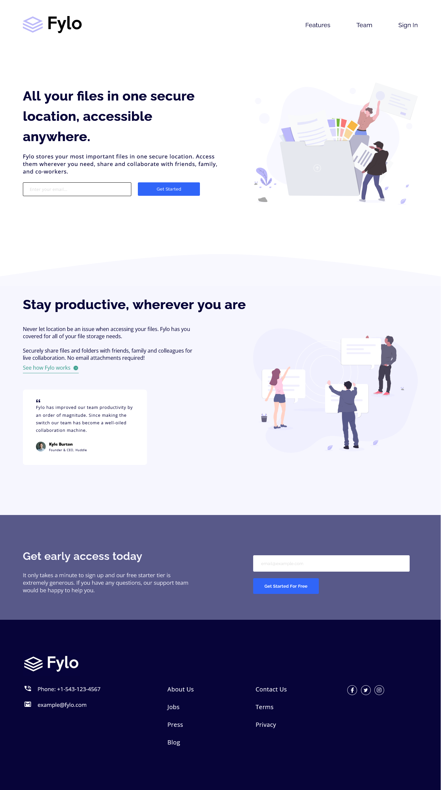

# Frontend Mentor - Fylo landing page with two column layout solution

This is a solution to the [Fylo landing page with two column layout challenge on Frontend Mentor](https://www.frontendmentor.io/challenges/fylo-landing-page-with-two-column-layout-5ca5ef041e82137ec91a50f5). Frontend Mentor challenges help you improve your coding skills by building realistic projects.

## Table of contents

- [Overview](#overview)
  - [The challenge](#the-challenge)
  - [Screenshot](#screenshot)
  - [Links](#links)
- [My process](#my-process)
  - [Built with](#built-with)
  - [What I learned](#what-i-learned)
  - [Continued development](#continued-development)
  - [Useful resources](#useful-resources)
- [Author](#author)
- [Acknowledgments](#acknowledgments)

## Overview

- This is a solution to fylo-landing-page-with-two-column-layout-master challenge on Frontend Mentor. This is a Junior challenge. To do this challenge, you need a basic understanding of HTML and CSS. I have tried to get the solution looking as close to the design as possible

### The challenge

Users should be able to:

- View the optimal layout for the site depending on their device's screen size
- See hover states for all interactive elements on the page

### Screenshot



### Links

- Frontend Mentor Solution URL: (https://www.frontendmentor.io/solutions/fylo-landing-page-with-two-column-layout-master-challenge-bcZ1l6UKsc)
- Live Site URL: (https://noura201.github.io/Frontend_Mentor_04_fylo-landing-page-with-two-column-layout-master_challenge/)
- Github Repo URL: (https://github.com/Noura201/Frontend_Mentor_04_fylo-landing-page-with-two-column-layout-master_challenge.git)

## My process

### Built with

- Semantic HTML5 markup
- CSS custom properties
- Flexbox

### What I learned

I have learned more while working through this project such as:

- Dealing With Form [Input & Button]

```html
<div class="input-div">
  <form>
    <input type="email" id="email" placeholder="email@example.com" required />
    <span class="error-msg">Please check your email</span>
    <a href="#">
      <button type="submit" for="email">get started for free</button>
    </a>
  </form>
</div>
```

- Dealing With Flexible Box

```css
.sec3 .input-div form {
  margin: 40px auto;
  display: flex;
  flex-direction: column;
  justify-content: center;
  align-items: center;
}
```

- If The Entered Email Is Valid, Then No Message Appear.
- If The Entered Email Is Invalid, Then Print "Please check your email".

```css
/* Valid Email */
.sec1 .txt-div .error-msg,
.sec3 .input-div .error-msg {
  visibility: hidden;
  color: #8a114db0;
  font-family: "OpenSans-VariableFont";
}
/* Invalid Email */
.sec1 .txt-div input:invalid:not(:focus):not(:placeholder-shown),
.sec3 .input-div input:invalid:not(:focus):not(:placeholder-shown) {
  border: 1.5px solid #8a114db0;
}
.sec1 .txt-div input:invalid:not(:focus):not(:placeholder-shown) + .error-msg,
.sec3
  .input-div
  input:invalid:not(:focus):not(:placeholder-shown)
  + .error-msg {
  visibility: visible;
}
```

- Dealing With Social Media Logos [Facebook - Twitter - Instagram]

```html
<div class="footer-logo">
  <div class="facebook-div">
    <a href="https://www.facebook.com" target="_blank">
      <svg xmlns="http://www.w3.org/2000/svg" viewBox="0 0 320 512">
        <path
          fill="hsl(240, 75%, 98%)"
          d="M80 299.3V512H196V299.3h86.5l18-97.8H196V166.9c0-51.7 20.3-71.5 72.7-71.5c16.3 0 29.4 .4 37 1.2V7.9C291.4 4 256.4 0 236.2 0C129.3 0 80 50.5 80 159.4v42.1H14v97.8H80z"
        />
      </svg>
    </a>
  </div>
</div>
```

```css
footer .footer-logo div {
  display: flex;
  flex-direction: row;
  justify-content: center;
  border-radius: 50%;
  border: 1.5px solid hsl(240, 75%, 98%);
}
footer .footer-logo div a {
  margin: 5px auto;
}
footer .footer-logo div:hover {
  cursor: pointer;
  border-color: hsl(238, 62%, 74%);
}
footer .footer-logo div path:hover {
  fill: hsl(238, 62%, 74%);
}
footer .footer-logo .facebook-div a {
  width: 5px;
  height: 5px;
  margin-top: 4px;
}
```

### Continued development

- I would like to train more about Flexible-Box property
- I want to learn more about the important CSS Property => Grid
- I'm seeking to do more realistic projects to improve my coding skills.
- I would like to train more about grouping multiple selectors perfectly to write a clean code and save more time and effort.

### Useful resources

- I have used the following font icon library: [Font Awesome](https://fontawesome.com/)
- When I faced an obstacle, I have searched on chatgpt to help me solve my problem.

## Author

- Github - [@NouraMamdouh](https://github.com/Noura201)
- Frontend Mentor - [@NouraMamdouh](https://www.frontendmentor.io/profile/Noura201)
- Linkedin - [@noura mamdouh](https://www.linkedin.com/in/noura-mamdouh-8a81982a4/)

## Acknowledgments

- I really have completed this challenge by myself.
